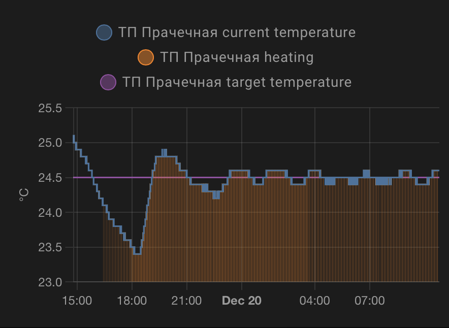

## General PID explanation

### PID parameters

* **Error**

  Difference between setpoint and current measured temperature. For example, if setpoint is `25.0` and current temperature is `23.8`, error is `1.2`. 


* **P - Proportional term.**

  This does not depend on time. `Error` will be multiplied to this value each `pid_sample_period` to get this term. 
  So, its value is depended on `pid_sample_period`. 
    
  Generally speaking, it is responsible for the basic sinus. 


* **I - Integral term.**
  
  This term depends on time and responsible for the `error` compensation during timeline.


* **D - Derivative term.**

  Usually not need in high inertia system like room heating/cooling.

### Tuning PID parameters

1. First start with some small `P`. Set `I` and `D` to 0.
2. Wait some time and check history graph. You should get **stable** `sin()` form on the `target_sensor` graph.
3. Adjust `P` to get minimal `sin()` period.
4. Set some initial `I`.
5. Check the history graph and adjust `I` until you will see stable straight line on the graph.

NOTE: **Be ready to spend 1-2 days during tuning** high inertia system, like water-heating floor. Be patient and final result will be amazing! :)

### PID regulation case: _water heating floor + room sensor_ 

* Heating floor has **very high inertia**.
* We have external heating floor thermostat, which was added to `HA` with climate domain. 
  We can directly adjust floor temperature with it by setting `climate` setpoint.
* We have room temperature sensor and want to have some constant room temperature.

I solved this case with:
```
pid_sample_period: 00:00:05
pid_params = 0.1, 0.001, 0
```

First graph is floor temperature, second is room temperature.

You can see on the graph, that after few hours room temperature was stabilized on setpoint `23.5`:


### PWM PID regulation case: _water heating floor (PWM mode)_

* Valve for heating floor collector with _open time around 3 mins and close time around 2 mins_. It is visible as `switch` entity in Home Assistant.
* DS18B20 sensor inside heating floor connected to ESPHome, with scan period 10 seconds.

```
pid_params: 10, 0.004, 0
pid_sample_period: "00:00:05"
pwm_period: "00:05:00"
```

